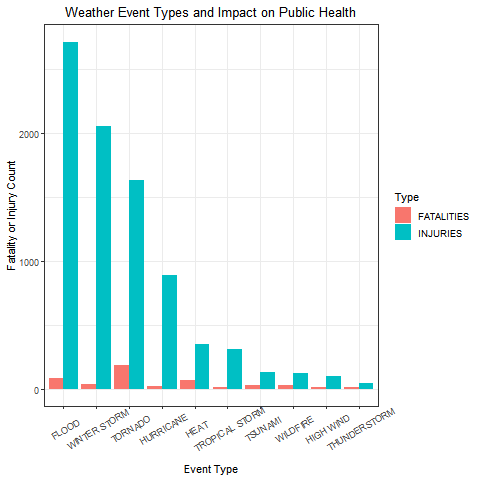
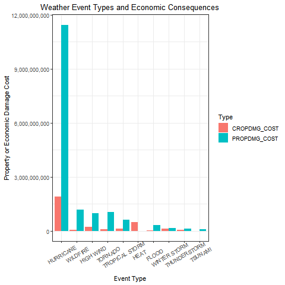

# **Reproducible Research Course Project 2: Harmful Population Health Impacts and Economic Consequences of US Extreme Weather Events**

--------------------------------------------------------------------

## **Abstract**

-   In this project, we took data from the Us. National Oceanic and
    Atmospheric Administration (NOAA) database) that tracks
    characteristics of major weather events in the United States.
    Our goal is to determine which types of weather events have the
    most harmful health impacts to the population and which types of
    weather events have the greatest economic consequences. Our
    analysis shows that floods are responsible for the greatest
    number of fatalities and injuries while hurricanes are
    responsible for causing the most property damage and crop damage
    costs.

--------------------------------------------------------------------

## **Introduction**

-   Storms and other severe weather events can cause both public
    health and economic problems for communities and municipalities.
    Many severe events can result in fatalities, injuries, and
    property damage, and preventing such outcomes to the extent
    possible is a key concern.

-   This project involves exploring the U.S. National Oceanic and
    Atmospheric Administration's (NOAA) storm database. This
    database tracks characteristics of major storms and weather
    events in the United States, including when and where they
    occur, as well as estimates of any fatalities, injuries, and
    property damage.

--------------------------------------------------------------------

## **Data**

-   The data for this assignment come in the form of a
    comma-separated-value file compressed via the bzip2 algorithm to
    reduce its size. The data was downloaded using this link from
    the course website:

    -   [Storm
        Data](https://d396qusza40orc.cloudfront.net/repdata%2Fdata%2FStormData.csv.bz2)
        [47Mb]

-   There is also some documentation of the database available. Here
    you will find how some of the variables are constructed/defined.

    -   National Weather Service [Storm Data
        Documentation](https://d396qusza40orc.cloudfront.net/repdata%2Fpeer2_doc%2Fpd01016005curr.pdf)
    -   National Climatic Data Center Storm Events
        [FAQ](https://d396qusza40orc.cloudfront.net/repdata%2Fpeer2_doc%2FNCDC%20Storm%20Events-FAQ%20Page.pdf)

-   The events in the database start in the year 1950 and end in
    November 2011. In the earlier years of the database there are
    generally fewer events recorded, most likely due to a lack of
    good records. More recent years should be considered more
    complete.

--------------------------------------------------------------------

## **Questions**

Our data analysis addresses the following questions:

1.  Across the United States, which types of events (as indicated in
    the EVTYPE variable) are most harmful with respect to population
    health?

2.  Across the United States, which types of events have the
    greatest economic consequences?

--------------------------------------------------------------------

## **Data Processing**

#### **1. Load packages used in this analysis.**

```{r}
library(dplyr)
library(tidyverse)
library(ggplot2)
```

#### **2. Load the data**

-   Download the compressed data file using the URL from the course
    website. Then use `read.csv` to load the data into our
    workspace.

```{r}
dataURL <- "https://d396qusza40orc.cloudfront.net/repdata%2Fdata%2FStormData.csv.bz2"

download.file("https://d396qusza40orc.cloudfront.net/repdata%2Fdata%2FStormData.csv.bz2", "StormData.csv.bz2")

Storm_Data <- read.csv("StormData.csv.bz2", header = TRUE, 
                       sep = ",")
```

#### **3. Display dataset summary**

-   Use `str(Storm_Data)` to display a summary of the dataset. The
    first line of output shows how many rows and columns this
    dataset has.

```{r}
str(Storm_Data)
```

#### **4. Create Subset of Data**

-   To answer our questions, we only need columns related to event
    types and their health and economic impacts, not all 37 columns
    will be used. Our data analysis will be limited to the following
    columns. Column name is in bold and description is in normal
    text. Column descriptions were taken from National Weather
    [Storm Data
    Documentation](https://d396qusza40orc.cloudfront.net/repdata%2Fpeer2_doc%2Fpd01016005curr.pdf).

    -   **EVTYPE**: type of weather event

    -   **FATALITIES**: fatalities due to weather even

    -   **INJURIES**: injuries due to weather event

    -   **PROPDMG**: property damage due to weather event

    -   **PROPDMGEXP**: multiplier for property damage (B =
        billions, K = thousands, M = millions)

    -   **CROPDMG**: crop damage due to weather event

    -   **CROPDMGEXP**: multiplier for crop damage (B = billions, K
        = thousands, M = millions)

```{r}
Storm_Data_subset <- c("EVTYPE", "FATALITIES", "INJURIES",
                      "PROPDMG", "PROPDMGEXP", "CROPDMG",
                      "CROPDMGEXP")
Storm_Data2 <- Storm_Data[, Storm_Data_subset]
summary(Storm_Data2)
```

-   We further subset our data to include only rows where
    fatalities, injuries, property damages, or crop damages are
    present.

```{r}
Storm_Data3 <- Storm_Data2 %>%
  filter(FATALITIES > 0, INJURIES > 0, CROPDMG > 0, PROPDMG > 0)
```

#### 5. **Determine total costs of property damage and crop damage per event type**

-   Multiply PROPDMG and CROPDMG by their respective exponent
    columns to get the cost columns PROPDMG_COST and CROPDMG_COST.

```{r}
Storm_Data3[Storm_Data3 == "B"] <- 10^9
Storm_Data3[Storm_Data3 == "K"] <- 10^3
Storm_Data3[Storm_Data3 == "M"] <- 10^6
Storm_Data3$PROPDMGEXP <- as.numeric(Storm_Data3$PROPDMGEXP)
Storm_Data3$CROPDMGEXP <- as.numeric(Storm_Data3$CROPDMGEXP)

Storm_Data4 <- Storm_Data3 %>% 
  mutate(PROPDMG_COST = PROPDMG * PROPDMGEXP) %>%
  mutate(CROPDMG_COST = CROPDMG * CROPDMGEXP)


Storm_Data5 <- Storm_Data4[, c("EVTYPE", "FATALITIES", 
                               "INJURIES", "PROPDMG_COST", 
                               "CROPDMG_COST")]
```

-   Use `group_by()` and `summarize_each()` from the *dplyr* library
    to find the values for each variable by event type.

```{r}
Storm_Data6 <- Storm_Data5 %>%
  group_by(EVTYPE) %>%
  summarize(across(c(FATALITIES, INJURIES, PROPDMG_COST, 
                     CROPDMG_COST), sum))
```

#### **6. Further clean dataset by EVTYPE**

At this time, our dataset has 23 unique EVTYPEs. A closer look at
the EVTYPE column shows that some of our weather event types are
still repeated due to slight variations between EVTYPE names (ex.
"FLASH FLOOD" and "FLOOD").

```{r}
unique(Storm_Data6$EVTYPE)
```

Similar EVTYPE values were condensed into categories to simplify
analysis. This further reduced our unique EVTYPEs from 23 to 10

```{r}
# Combine similar EVTYPE values
Storm_Data6$EVTYPE <- gsub("BLIZZARD", "WINTER STORM",
                           Storm_Data6$EVTYPE)
Storm_Data6$EVTYPE <- gsub("EXCESSIVE HEAT", "HEAT",
                          Storm_Data6$EVTYPE)
Storm_Data6$EVTYPE <- gsub("FLASH FLOOD", "FLOOD", 
                           Storm_Data6$EVTYPE)
Storm_Data6$EVTYPE <- gsub("HEAT WAVE DROUGHT", "HEAT", 
                           Storm_Data6$EVTYPE)
Storm_Data6$EVTYPE <- gsub("HEAVY SNOW", "WINTER STORM", 
                           Storm_Data6$EVTYPE)
Storm_Data6$EVTYPE <- gsub("HIGH WINDS", "HIGH WIND", 
                           Storm_Data6$EVTYPE)
Storm_Data6$EVTYPE <- gsub("HURRICANE/TYPHOON", "HURRICANE", 
                           Storm_Data6$EVTYPE)
Storm_Data6$EVTYPE <- gsub("ICE STORM", "WINTER STORM", 
                           Storm_Data6$EVTYPE)
Storm_Data6$EVTYPE <- gsub("THUNDERSTORM WINDS", "THUNDERSTORM",                            Storm_Data6$EVTYPE)
Storm_Data6$EVTYPE <- gsub("THUNDERSTORM WIND", "THUNDERSTORM",                            Storm_Data6$EVTYPE)
Storm_Data6$EVTYPE <- gsub("TROPICAL STORM GORDON", 
                           "TROPICAL STORM", Storm_Data6$EVTYPE)
Storm_Data6$EVTYPE <- gsub("TSTM WIND", "THUNDERSTORM", 
                           Storm_Data6$EVTYPE)
Storm_Data6$EVTYPE <- gsub("WINTER STORM HIGH WIND", 
                           "WINTER STORM", Storm_Data6$EVTYPE)
Storm_Data6$EVTYPE <- gsub("WINTER STORMS", "WINTER STORM",
                           Storm_Data6$EVTYPE)
```

-   Use `group_by()` and `summarize_each()` from the *dplyr* library
    to find the values for each variable by event type.

```{r}
Storm_Data7 <- Storm_Data6 %>%
  group_by(EVTYPE) %>%
  summarize(across(c(FATALITIES, INJURIES, PROPDMG_COST, 
                     CROPDMG_COST), sum))
```

--------------------------------------------------------------------

## **ANALYSIS**

#### **1. Estimate the total health impact (fatalities and injuries) of each event type**

-   For each event type, find the sum of fatalities and injuries to
    find the total health impact on the population. Sort the results
    in descending order by total health impact.

```{r}
Storm_Data8 <- Storm_Data7 %>%
  mutate(TotalHealthImpact = FATALITIES + INJURIES)


Storm_Data_Health <- Storm_Data8[, c("EVTYPE", "FATALITIES", 
                                     "INJURIES", 
                                     "TotalHealthImpact")] %>%
  arrange(desc(TotalHealthImpact))
```

#### **2. Estimate the total economic cost (property and crop damage) of each event type**

-   For each event type, find the sum of property and crop damage to
    find the total economic cost. Sort the results in descending
    order by total economic cost.

```{r}
Storm_Data9 <- Storm_Data7 %>%
  mutate(TotalEconomicCost = PROPDMG_COST + CROPDMG_COST)

Storm_Data_Economic <- Storm_Data9[, c("EVTYPE", 
                                       "CROPDMG_COST",
                                       "PROPDMG_COST", 
                                       "TotalEconomicCost")] %>%
  arrange(desc(TotalEconomicCost))
```

--------------------------------------------------------------------

## Results

#### **1. Event Types Most Harmful to Population Health**

-   The results below show the 10 most harmful weather events in
    terms of population health in the U.S., as measured by
    fatalities and injuries. **FLOOD events show the greatest health
    impact.**

    <br>

    {width="600"}

```{r}
# Transform EVTYPE to a factor variable
Storm_Data_Health$EVTYPE <- as.factor(Storm_Data_Health$EVTYPE)

Storm_Data_Health2 <- Storm_Data_Health %>%
  gather(Type, value = Impact, 2:3)


png("health_plot.png")
health_plot <- ggplot(Storm_Data_Health2, 
                      aes(x = reorder(EVTYPE, 
                                      -TotalHealthImpact), 
                          y = TotalHealthImpact,
                          fill = Type)) +
  geom_col(aes(x = reorder(EVTYPE, -TotalHealthImpact),
               y = Impact), position = "dodge") + 
  labs(x= "Event Type", y = "Fatality or Injury Count") +
  theme_bw() +
  theme(axis.text.x = element_text(angle = 30, vjust=0.7)) + 
  ggtitle("Weather Event Types and Impact on Public Health") +
  theme(plot.title = element_text(hjust = 0.5))

print(health_plot)
dev.off()
```

#### **2. Event Types with the Greatest Economic Consequences**

-   The results below show the 10 weather events with the greatest
    economic consequences events in the U.S., as measured by crop
    damage costs (CROPDMG_COST) and property damage costs
    (PROPDMG_COST). **Hurricane events show the greatest cost in
    both categories.**

    <br>

    {width="600"}

```{r}
# Transform EVTYPE to a factor variable
Storm_Data_Economic$EVTYPE <- as.factor(
  Storm_Data_Economic$EVTYPE)

Storm_Data_Economic2 <- Storm_Data_Economic %>%
  gather(Type, value = Cost, 2:3)


png("economic_plot.png")
economic_plot <- ggplot(Storm_Data_Economic2, 
                      aes(x = reorder(EVTYPE, 
                                      -TotalEconomicCost), 
                          y = TotalEconomicCost,
                          fill = Type)) +
  geom_col(aes(x = reorder(EVTYPE, -TotalEconomicCost),
               y = Cost), position = "dodge") + 
  labs(x= "Event Type", 
       y = "Property or Economic Damage Cost") +
  theme_bw() +
  theme(axis.text.x = element_text(angle = 30, vjust=0.7)) + 
  ggtitle("Weather Event Types and Economic Consequences") +
  theme(plot.title = element_text(hjust = 0.5)) + 
  scale_y_continuous(labels = scales::comma)

print(economic_plot)
dev.off()
```

--------------------------------------------------------------------

## **Conclusion**

Based on the evidence demonstrated in this analysis and supported by
the included data and graphs, the following conclusions can be
drawn:

1.  **Across the United States, which types of events (as indicated
    in the EVTYPE variable) are most harmful with respect to
    population health?**

    -   Floods are responsible for the greatest number of fatalities
        and injuries.

2.  **Across the United States, which types of events have the
    greatest economic consequences?**

    -   Hurricanes are responsible for causing the most property
        damage and crop damage costs.
